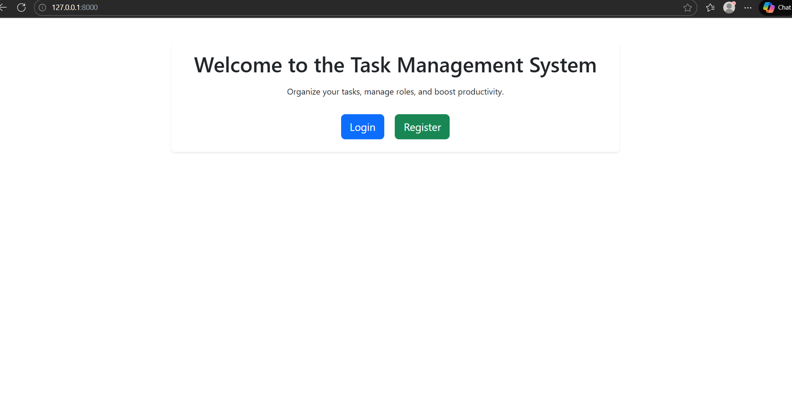
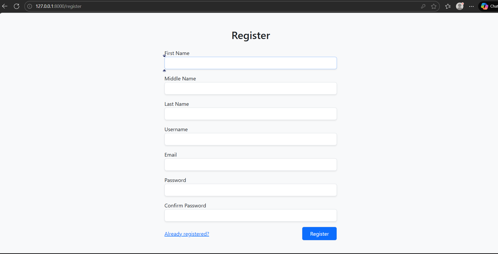
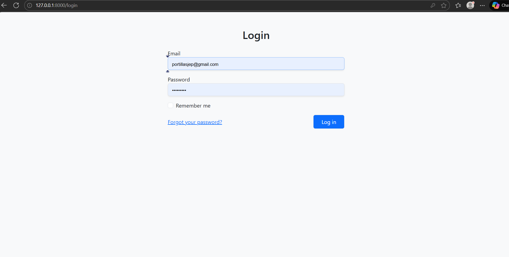
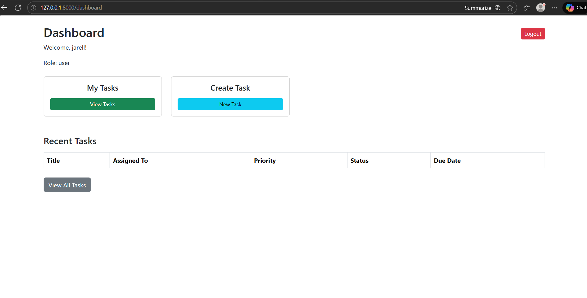
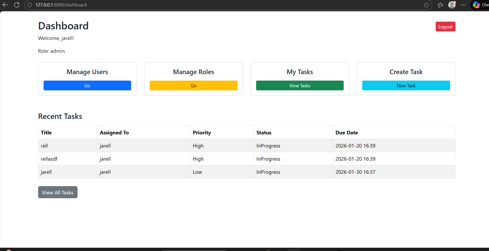
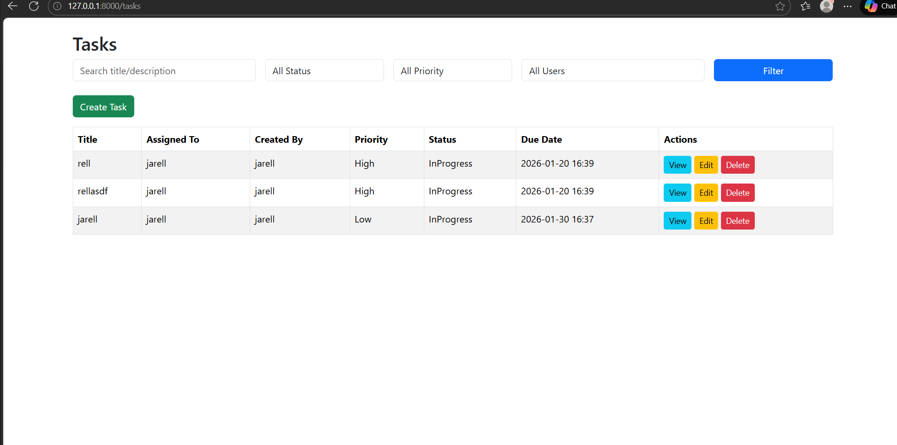

Task Management System

A web-based Task Management System built with Laravel, Blade, Bootstrap, and Breeze.
Manage tasks, roles, and users with role-based access control.

Features

User Management: Registration, login, profile, admin manages users

Role Management (Admin): CRUD roles, assign/remove roles

Task Management: CRUD tasks, assign users, filter/search, status update

Dashboard: Quick links, recent tasks, responsive UI

Tech Stack

Backend: Laravel 11, PHP 8+

Frontend: Blade, Bootstrap 5

Database: MySQL

Auth: Laravel Breeze

Setup
git clone https://github.com/yourusername/task-management-system.git
cd task-management-system
composer install
npm install
npm run dev
cp .env.example .env
# Update DB credentials in .env
php artisan migrate --seed
php artisan serve


Visit http://localhost:8000

Default Admin:
Email: admin@example.com
Password: password


```

## 📸 Preview



---

---


---


---


---


---